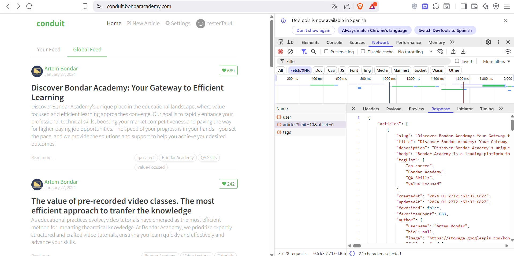

# Testing APIs - Cypress Automation

## 📋 Descripción
Proyecto de automatización de pruebas para APIs usando Cypress, enfocado en testing de registro de usuarios y validación de respuestas HTTP.

## 🚀 Instalación


# Instalar dependencias
npm install cypress --save-dev

# Abrir Cypress
npx cypress open
```

## 📁 Estructura del Proyecto

```
testingApis/
├── cypress/
│   ├── e2e/
│   │   ├── apiSignUp.cy.js     # Test de registro de usuarios
│   │   ├── tags.cy.js          # Test de mocking de tags
│   │   └── nueva.cy.js         # Test de mocking de artículos
│   ├── fixtures/
│   │   └── tags.json           # Datos de prueba para tags
│   └── support/
└── README.md
```

## 🧪 Tests Implementados

### API Sign Up Test (`apiSignUp.cy.js`)
Prueba automatizada para el registro de usuarios:

```javascript
describe('log',()=>{
    it("Crear usuario ok",()=>{
        cy.intercept('POST', '/api/users').as('tau99')
        cy.visit("https://conduit.bondaracademy.com/")
        cy.contains('Sign up').click()
        
        // Generación de datos únicos
        const randomNum = Math.floor(Math.random() * 10000)
        const username = `testerTau${randomNum}`
        const email = `test${randomNum}@gmail.com`
        
        // Llenar formulario
        cy.get(':nth-child(1) > .form-control').type(username)
        cy.get(':nth-child(2) > .form-control').type(email)
        cy.get(':nth-child(3) > .form-control').type('12345678')
        cy.get('.btn').click()
        
        // Validaciones
        cy.wait('@tau99').then((interception) => {
            expect(interception.response.statusCode).to.equal(201)
            expect(interception.response.body.user.username).to.equal(username)
            expect(interception.response.body.user.email).to.equal(email)
        })
    })
});
```

**Características:**
- ✅ Generación de datos únicos por ejecución
- ✅ Intercepción de peticiones HTTP
- ✅ Validación de código de estado 201 (Created)
- ✅ Verificación de datos en la respuesta

### Tags Mocking Test (`tags.cy.js`)
Prueba de mocking para tags usando fixtures:

```javascript
describe('Mocking Tests', () => {
    it('Mocking',()=>{
        cy.intercept('GET', '/api/tags*',{fixture: 'tags.json'}).as('Tau99Tags');
        cy.visit("https://conduit.bondaracademy.com/")
        
        cy.wait('@Tau99Tags')
        cy.contains('Test').should('be.visible')
        cy.contains('Cypress').should('be.visible')
        cy.contains('Bondar Academy').should('be.visible')
    });
})
```

## 📊 Códigos de Estado HTTP

| Código | Significado | Uso en el proyecto |
|--------|-------------|-------------------|
| 200 | OK | Peticiones exitosas generales |
| 201 | Created | Registro exitoso de usuarios |
| 400 | Bad Request | Datos inválidos |
| 401 | Unauthorized | Sin autorización |
| 404 | Not Found | Recurso no encontrado |

## 🔧 Comandos Útiles

```bash
# Ejecutar todos los tests
npx cypress run

# Ejecutar un test específico
npx cypress run --spec "cypress/e2e/apiSignUp.cy.js"

# Abrir interfaz gráfica
npx cypress open

# Ejecutar en modo headless
npx cypress run --headless
```

## 📄 Fixtures

### `tags.json`
Archivo de datos de prueba para tags:
```json
{
    "tags": [
        "Test",
        "Git",
        "Zoom",
        "YouTube",
        "Blog",
        "Bondar Academy",
        "Cypress",
        "Testing",
        "JavaScript",
        "Programming"
    ]
}
```

## 🛠️ Técnicas Utilizadas

- **Intercepción de APIs**: `cy.intercept()` para capturar peticiones HTTP
- **Alias**: `.as()` para referenciar intercepts
- **Fixtures**: Archivos JSON para datos de prueba
- **Mocking**: Simulación de respuestas de API
- **Generación de datos únicos**: Para evitar conflictos en tests
- **Validaciones**: Verificación de códigos de estado y contenido

## 🌐 URL de Pruebas
- **Aplicación**: https://conduit.bondaracademy.com/
- **API Base**: `/api/`

## 📝 Notas Importantes

1. **Datos Únicos**: Cada ejecución genera usernames y emails únicos
2. **Fixtures vs Fixture**: 
   - `fixtures/` = carpeta
   - `fixture:` = comando para usar archivos
3. **Códigos 201**: Confirman creación exitosa de recursos
4. **Mocking**: Permite testing independiente del backend

## 🚀 Próximas Mejoras
- [ ] Implementar tests de login
- [ ] Agregar validaciones de errores
- [ ] Tests de stress con múltiples usuarios
- [ ] Integración con CI/CD

---
**Autor**: Tester de Software  
**Herramientas**: Cypress, JavaScript, JSON


## Recursos
- [Documentación oficial de Cypress](https://docs.cypress.io/) 

